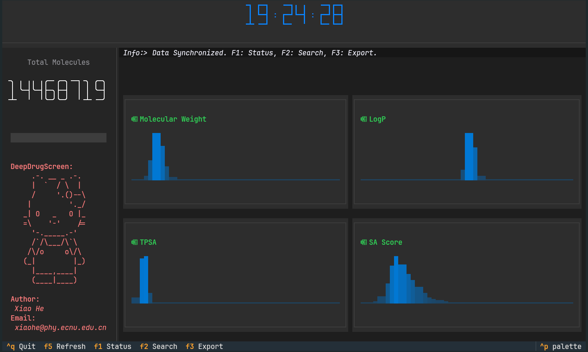
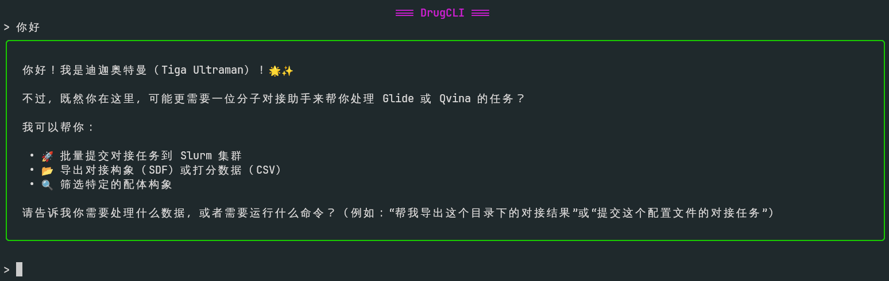

# DeepDrugScreen
    - author: iawnix
    - date: 2026-04-11
# Install
- `conda create -n dds python=3.12`
- `conda activate dds`
- `pip install .`
- 设置环境变量
``` 
export PSQ_DB_HOST="DB IP"
export PSQ_DB_PORT="DB PORT"
export PSQ_DB_USR="DB USR"
export PSQ_DB_PASSWD="DB PASSWD"
export PSQ_DB_NAME="DB NAME"
export SCHRODINGER_ENV_HOME="schrodinger home"
export SCHRODINGER_ENV_TMPDIR="schrodinger scratch"
export MODEL_URL="YOUR_MODEL_URL"
export MODEL_API_KEY="YOUR_MODEL_API_KEY"
export MODEL_NAME="YOUR_MODEL_NAME"
export DRUGCLI_SESSION="SAVE_SESSION_MEMORY"

```

> PostgreSQL 配体库的初始化（建表、GIST/GIN 化学指纹索引、SA score 回填）见
> [`src/util/rdkit_postgresql/README.md`](src/util/rdkit_postgresql/README.md)。

# Usage
- DBShow
    - 

    PG+RDKit 配体库的 Textual 终端 UI。启动后无参数：

    ```
    DBShow
    ```

    快捷键：
    - `F1` Status：显示分子总数与 MW / LogP / TPSA / SA Score 的分布稀疏图
    - `F2` Search：按 SMILES 精确查询或按 IAWID 查询
    - `F3` Export：批量过滤并导出 CSV，三种模式互斥
        - **Similarity**：填 Target SMILES + 阈值（默认 0.7）+ 上限（默认 10000）
        - **Substructure**：填 Target SMILES + 上限
        - **Properties**：MW / LogP / TPSA 任意一项填 `min,max`（如 `200,500`）
    - `F5` Refresh（仅在 F1 视图下生效）
    - `Ctrl-Q` 退出

- DrugCLI
    - 

    对话式入口。`Enter` 提交，`Ctrl-\` 换行；普通文本走 `MODEL_URL` 上的 OpenAI 兼容接口，
    模型可通过 function-call 触发下面任一 slash 命令。会话以 UUID 命名的 JSON 持久化到 `$DRUGCLI_SESSION`。

    内置 slash 命令：
    | 命令 | 作用 |
    | --- | --- |
    | `/exit` | 退出 |
    | `/new` | 保存当前会话并新建一个 |
    | `/session` | 用列表挑选已保存的历史会话 |
    | `/exec <bash>` | 在本地执行 bash 命令并把结果回灌给模型 |
    | `/SbatchDock -config <json> -docker Glide` | 等价于直接调用 `SbatchDock` |
    | `/ExportDockPose -InDir/-InFile/-InFiles <path> [-output ...] [-cpu ...] [-verbose true]` | 等价 `ExportDockPose` |
    | `/ExportDockScore -InDir/-InFile/-InFiles <path> [-output ...] [-cpu ...] [-verbose true]` | 等价 `ExportDockScore` |
    | `/ExportSelectPose -InFiles <dir> -SelectID <id.csv> [-output ...] [-cpu ...]` | 等价 `ExportSelectPose` |

- SbatchDock

    把一个目录下的所有配体 csv 子库批量提交到 Slurm，每个 csv 起一个独立作业。

    ```
    SbatchDock -config glide_config.json -docker Glide
    ```

    `glide_config.json` 字段（参考 `test/glide_config.json`）：

    | 字段 | 说明 |
    | --- | --- |
    | `Pydocker` | `GlideDock` 入口的绝对路径（推荐用 `which GlideDock` 取） |
    | `LIG_CSV` | 存放配体 csv 子库的**目录**，目录下每个 `*.csv` 起一个作业 |
    | `nNODE` / `nCPU` | Slurm `--ntasks-per-node` / `--cpus-per-task` |
    | `grid` | Glide grid 文件路径 |
    | `splitStep` | 单作业内再按多少行切片做 ligprep+glide |
    | `pH` / `numStere` | `ligprep -epik -ph -s` 参数 |
    | `precision` | Glide 精度，`SP` / `XP` 等 |

    > 路径请只写最后一层名字，不要带额外符号。

- GlideDock

    Slurm 节点上单作业的执行体（一般由 `SbatchDock` 通过生成的 `jobsub.sh` 间接调用），
    也可手动跑：

    ```
    GlideDock -i config.json
    ```

    执行流程：在当前目录建 `FlowByIaw/`，按 `splitStep` 把 csv 切成 `Sub-1, Sub-2, …`，
    每个子目录内依次跑 `ligprep -epik` → `glide`，输出
    `FlowByIaw/Sub-N/glideDock-N/glideDock-N{.log,_pv.maegz,...}`。

- ExportDockScore

    解析 Glide `.log`，grep 出 `(ligand id, GlideScore)` 写成 CSV。

    ```
    ExportDockScore -InDir  <SbatchDock 输出根目录> -output OutCsv -cpu 8
    ExportDockScore -InFile <single.log>            -output OutCsv
    ExportDockScore -InFiles <flat dir of *.log>    -output OutCsv -cpu 8
    ```

    - `-InDir`：自动按 `*/FlowByIaw/Sub-*/glideDock-*/glideDock-*.log` 递归收集
    - `-InFiles`：目录下所有 `*.log` 平铺收集
    - `-output` 目录必须**不存在**，由程序新建

- ExportDockPose

    `structconvert -imae … -osd …` 把 `*.maegz` 批量转 SDF（含全部 pose）。

    ```
    ExportDockPose -InDir  <SbatchDock 输出根目录> -output GlideOutPose -cpu 8
    ExportDockPose -InFile <single.maegz>          -output GlideOutPose
    ExportDockPose -InFiles <flat dir of *.maegz>  -output GlideOutPose -cpu 8
    ```

    收集规则与 `ExportDockScore` 一致，把 `.log` 替换成 `.maegz`。

- ExportSelectPose

    从 `ExportDockPose` 产生的 SDF 目录里，按 ID CSV 把目标构象抽出来合并到一个 SDF。

    ```
    ExportSelectPose -InFiles <dir of *.sdf> -SelectID hits.csv -output SelectGlidePose.sdf -cpu 8
    ```

    - `hits.csv` 必须包含 `ID` 列（值需对应 SDF 中的 `_Name` / `s_lp_Variant` 前缀）
    - 输出为单个合并 SDF，每条分子写入 `_Name` 与 `r_i_docking_score`

# Pipeline
典型工作流：
1. 按 `src/util/rdkit_postgresql/README.md` 建库；
2. `DBShow` 浏览/过滤/导出候选配体 CSV；
3. `SbatchDock` 把 CSV 子库批量投递到 Slurm；
4. `ExportDockScore` 汇总打分并挑出命中 ID；
5. `ExportDockPose` 把 maegz 批量转 SDF；
6. `ExportSelectPose` 按 ID CSV 抽取最终 pose；
7. 上述步骤可在 `DrugCLI` 中以自然语言或 slash 串起来。
