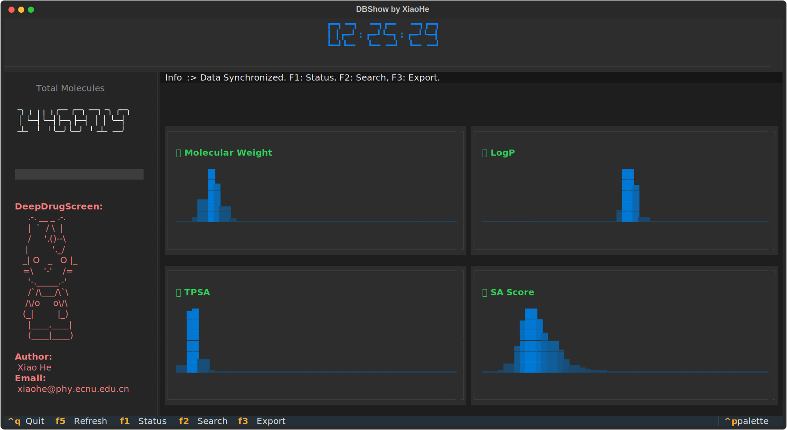

# DeepDrugScreen
    - author: iawnix
    - date: 2026-04-11
# Install
- `conda create -n dds python=3.12`
- `conda activate dds`
- `pip install .`
- 设置环境变量
``` 
export PSQ_DB_HOST="DB IP"
export PSQ_DB_PORT="DB PORT"
export PSQ_DB_USR="DB USR"
export PSQ_DB_PASSWD="DB PASSWD"
export PSQ_DB_NAME="DB NAME"
export SCHRODINGER_ENV_HOME="schrodinger home"
export SCHRODINGER_ENV_TMPDIR="schrodinger scratch"
```
# Usage
- DBShow
    - 
